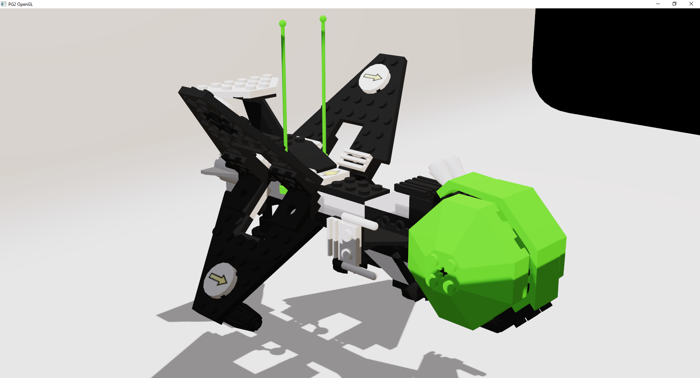
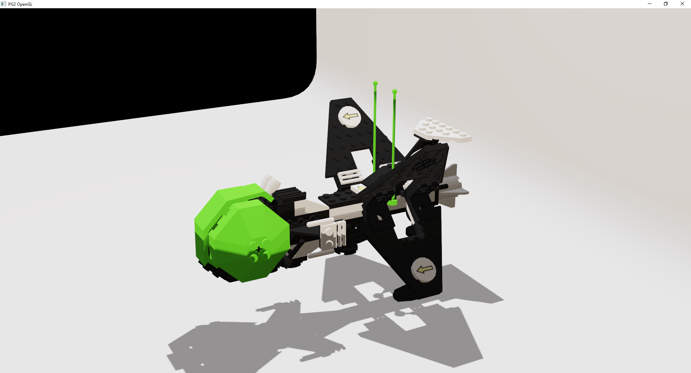
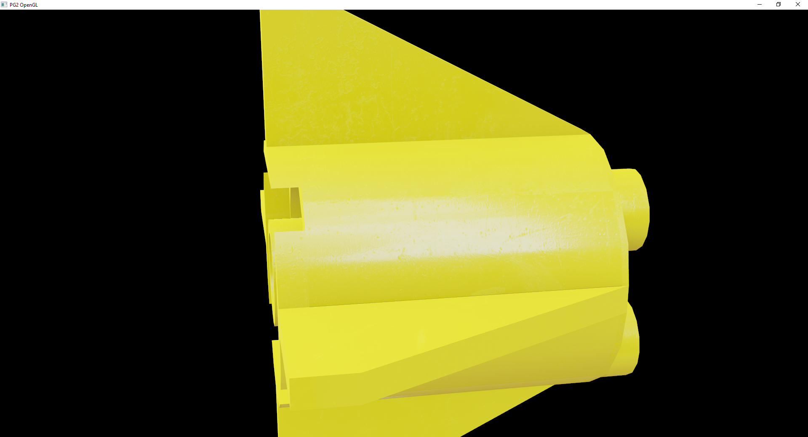
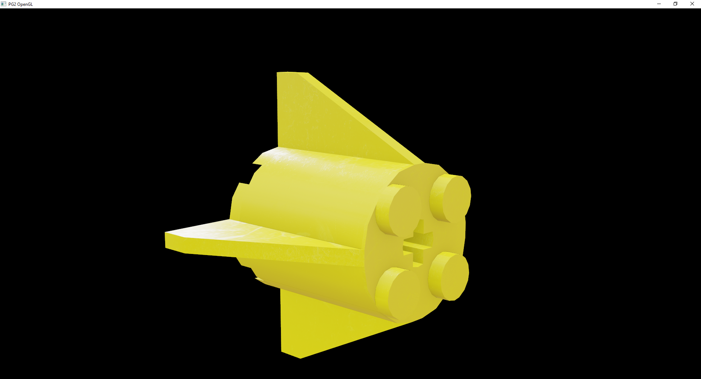
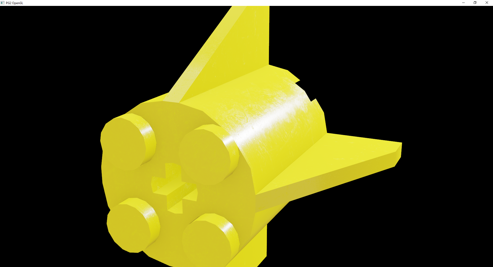

# PG2

Computer Graphics 2. OpenGL rendering engine.

### Requirements

- Nvidia GPU (Bindless textures)
- OpenGL 4.4+             

### Instalation

1. Download this repository
2. Open [solution](pg2_opengl/pg2_opengl.sln)  
3. Build & Run

### Features

- [x] Rotating Camera
- [x] Adjustable Camera
- [x] Object loading
- [x] Material loading
- [x] Bindless textures
- [x] PBR & IBL Rendering
- [x] Normal mapping
- [x] Shadow mapping with PCF
- [x] Point light

### Scenes

Active scene can be changed in file [tutorials.cpp](pg2_opengl/pg2_opengl/tutorials.cpp) by setting `#define SCENE` to scene value.
For simplicity just uncomment line above `tutorial_2` method.           

#### Cube                           

Basic scene with cube in center.
- [x] Included

#### Commander                    

Large object scene.
- [ ] Not included due to size

#### Avanger

Shadow mapping and multiple meshes loading.
- [x] Included

|Left side|Right side|
|:--|--:|
|||

#### Piece

Single mesh scene.
PBR, IBL rendering. Normal mapping. RMA mapping.
- [x] Included

|Ambient lighting|Roughness & normals|Direct lighting|
|:--|---|--:|
||||

### Shaders

All shaders are loaded from [shaders directory](pg2_opengl/pg2_opengl/shaders).

- [ ] triangle - not used anymore, historic value
- [x] normal - view normals and normal mapping
- [x] lambert - simple lighting, includes normal mapping
- [x] pbr - PBR & IBL shader, normal & rma mapping
- [x] pbr shadow - pbr shader with shadow mapping
- [x] shadow - used to render shadow map
- [x] shadow view - used to debug shadows from camera and view depth

### Controls

All scene changes are controled in [tutorials.cpp](pg2_opengl/pg2_opengl/tutorials.cpp) file in method `handle_inputs`.

- Camera rotation to left is activated by default
- You can change camera position, target, light position by controls bellow

`M_L` - mouse left ,
`M_R` - mouse right , 
`M_C` - mouse center

|Action|Bind|Description|
|---|---|---|
|Increase|`M_L`|Increases selected parameter|
|Decrease|`M_R`|Decreases selected parameter|
|Next parameter|`M_C`(hold) + `M_L`(click)|Selects next parameter|
|Previous parameter|`M_C`(hold) + `M_R`(click)|Selects previous parameter|

Parameters values are printed in console.

 `selected parameter > camera X Y Z, target X Y Z, light X Y Z`.

|Position|Parameter|
|--------|---------|
|0|Camera target X|
|1|Camera target Y|
|2|Camera target Z|
|3 (default)|Camera position X|
|4|Camera position Y|
|5|Camera position Z|
|6|Light position X|
|7|Light position Y|
|8|Light position Z|